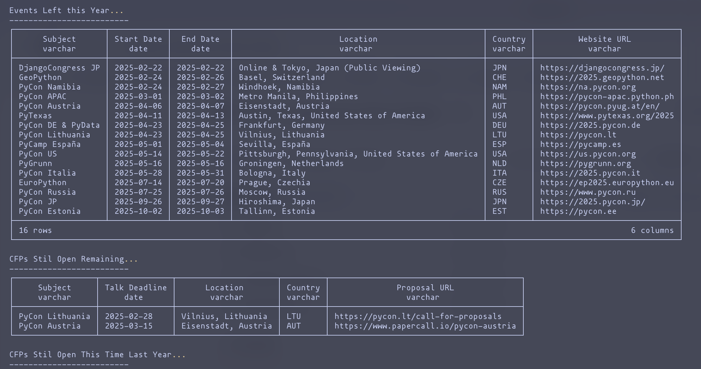

# Python Conferences Duck Tracker



A Python script that fetches and analyzes Python conference data from the [python-organizers/conferences](https://github.com/python-organizers/conferences) repository. The script provides insights about upcoming conferences, open Call for Proposals (CFPs), and historical conference data.

## Features

- Downloads conference data for the current and previous year
- Shows upcoming conferences and events
- Lists currently open CFPs
- Compares current CFP opportunities with the same period last year
- Uses DuckDB for efficient SQL querying of CSV data

## Requirements

```
httpx
duckdb
rich
```

## Installation

1. Clone this repository
2. Install the required packages:

   ```bash
   pip install -r requirements.txt
   ```

## Usage

Simply run the script:

```bash
python conference_analyzer.py
```

The script will:

1. Download conference data for the current and previous year as CSV files - from <https://github.com/python-organizers/conferences/>
2. Execute three analyses:
   - Shows upcoming events for the current year
   - Lists currently open CFPs
   - Compares current CFP opportunities with the same period last year

## Output Format

The script generates three sections:

1. **Events Left this Year**

   - Conference name
   - Start and end dates
   - Location and country
   - Website URL

2. **CFPs Still Open**

   - Conference name
   - Talk submission deadline
   - Location and country
   - Proposal submission URL

3. **Historical CFP Comparison**
   - Shows CFPs that were open during the same period last year
   - Limited to 20 results closest to date

## Data Source

The conference data is sourced from the [python-organizers/conferences](https://github.com/python-organizers/conferences) GitHub repository, which maintains a curated list of Python conferences worldwide.

## Note

The script uses the current date as a reference point for all queries, ensuring that only relevant future events and deadlines are displayed.
